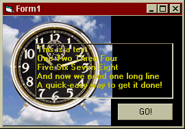



## REAL Transparent Textbox

### Description

Makes a textbox transparent.

Here's how I do it:

Get the DC from the textbox hWnd.

Paint the textbox text onto the textbox parent.

Paint the parent's image onto the textbox.

Pretty Simple eh?
 
### More Info
 

             |
---                |---
**Submitted On**   |2001-05-10 08:33:06
**By**             |[Dave Andrews](https://github.com/Planet-Source-Code/PSCIndex/blob/master/ByAuthor/dave-andrews.md)
**Level**          |Intermediate
**User Rating**    |4.0 (16 globes from 4 users)
**Compatibility**  |VB 5\.0
**Category**       |[Custom Controls/ Forms/  Menus](https://github.com/Planet-Source-Code/PSCIndex/blob/master/ByCategory/custom-controls-forms-menus__1-4.md)
**World**          |[Visual Basic](https://github.com/Planet-Source-Code/PSCIndex/blob/master/ByWorld/visual-basic.md)
**Archive File**   |[REAL Trans194705102001\.zip](https://github.com/Planet-Source-Code/dave-andrews-real-transparent-textbox__1-23089/archive/master.zip)

